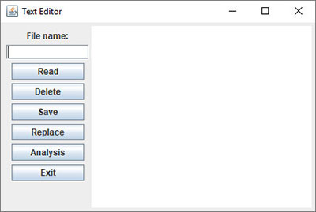
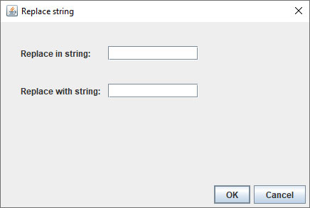
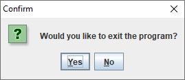
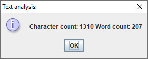

# Lab no. 13

## Problem 1
*(to be done by the TA with students' help)*

Create public class **TextDemo**, in package **problem1.business_logic**, that has:

- Public method **readText** that takes the name of a textual file as its input argument. The method reads all text from the file with the given name and returns it as one String. The method should assure that the line breaks from the input file are preserved in the returned string. If an error occurs during reading from the file, the method should throw an appropriate exception.

- Public method **writeText** that accepts two Strings as its arguments: the file name, and some text. The method writes the provided text into the file defined by the first argument. If an error occurs during the writing task, the method should throw an appropriate exception.

Create a visual class **TextEditorGUI** in package **problem1.gui**, that looks as shown on the figure below. The central screen area should be the text editor. When the form is resized, this central part should be enlarged/shrunk, while other components should stay in place, as shown in the following figure.

- The class should have a private attribute **textDemo** of type **TextDemo**, that is initialized in the declaration.

- When the "Delete" button is clicked, the text from the editor should be erased.

- When the "Read" button is clicked, the name of a text file should be taken from the input field, and the text from the file should be displayed in the editor. Reading should be done using the appropriate method from the **TextDemo** class. In case of an error, the error message should be displayed in an JOptionPane dialog.

- When the "Save" button is clicked, the text that is displayed in the editor should be saved in the file whose name is given in the input field. Writing should be performed by calling the appropriate method from the class **TextDemo**. In case of an error, the error message should be displayed in an JOptionPane dialog.

- When the "Replace" button is clicked, a dialog should open (see the figure below). There, the user enters a String that should be replaced and a String that it should be replaced with. After the **OK** button is clicked, string replacement should be applied to the text in the editor.

- When the "Exit" button is clicked, the program asks the user for confirmation to quit the program. If the user chooses to quit, the execution halts.

## Problem 2
*(students do on their own)*

- Add the **Analysis** button, which, when clicked, counts the number of characters and words in the text and opens a new dialog (see the figure below) that displays the computed values.

