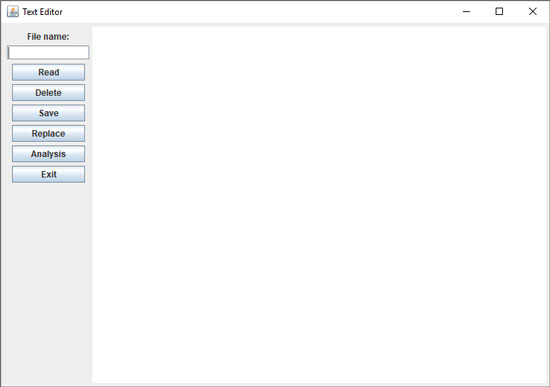
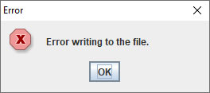
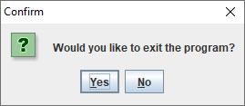

#Lab no. 13

##Problem 1
*(worked through by the TA with students' help)*

Write public class **TextDemo** in package **problem1.business_logic**, that has:

- Public method **readText** that takes the name of the textual file as its input argument. This method reads all text from that file and returns it as one String. The method should take care of the symbol for the line end, which the return String should contain. If an error occurs during reading from the file, the method should throw an appropriate exception.

- Public method **enterText** that accepts two Strings as its arguments: the file name, and some text. This method writes the provided text into the file determined by the first argument. If an error occurs during input, the method should throw an appropriate exception.

Create a visual class **TextEditorGUI** in package **problem1.gui**, that appears as displayed in the figure. The central screen area should be the text editor. When the form is resized, this central part should be enlarged/shrinked, while other components should stay in place, as shown in the following figure.

- The class should have a private attribute **textDemo** of type **TextDemo**, that is initialized in the declaration.

- When the "Delete" button is clicked, the text from the editor should be erased.

- When the "Read" button is clicked, the name of a text file should be taken from the input field, and the text from the file should be displayed in the editor. Reading should be done using the methods from class **TextDemo**. In case of an error, display the JOptionPane dialog with an appropriate message.

- When the "Save" button is clicked, the text that is displayed in the editor should be saved in the file whose name is in the input field. Writing should be performed by calling the appropriate method from the class **TextDemo**. In case of an error, display the JOptionPane dialog with an appropriate message.

- When the "Replace" button is clicked, a dialog should open. There, the user enters a String that should be replaced and a String that it should be replaced with. After the **OK** button is clicked, replacing of the string in the text in the editor should be performed.

- When the "Exit" button is clicked, the program asks the user for confirmation. If the user chooses to quit, the execution halts.

## Problem 2
*(students solve on their own)*

- Add the **Analysis** button, which, when clicked, counts the number of characters and words in the text and opens new dialog which displays this data.

